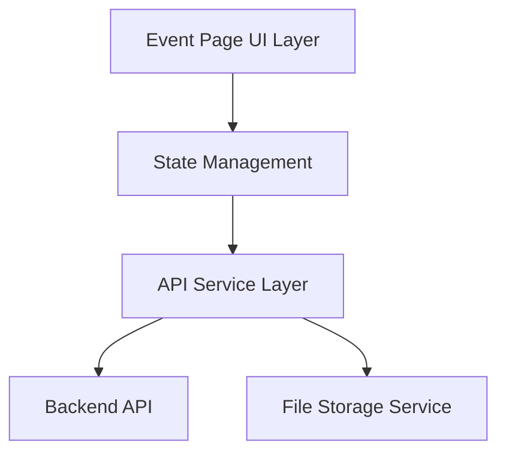
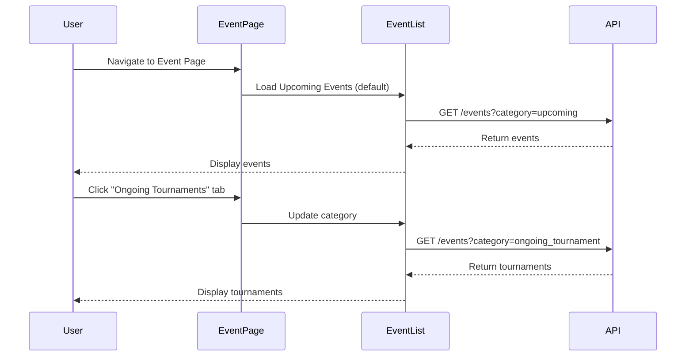
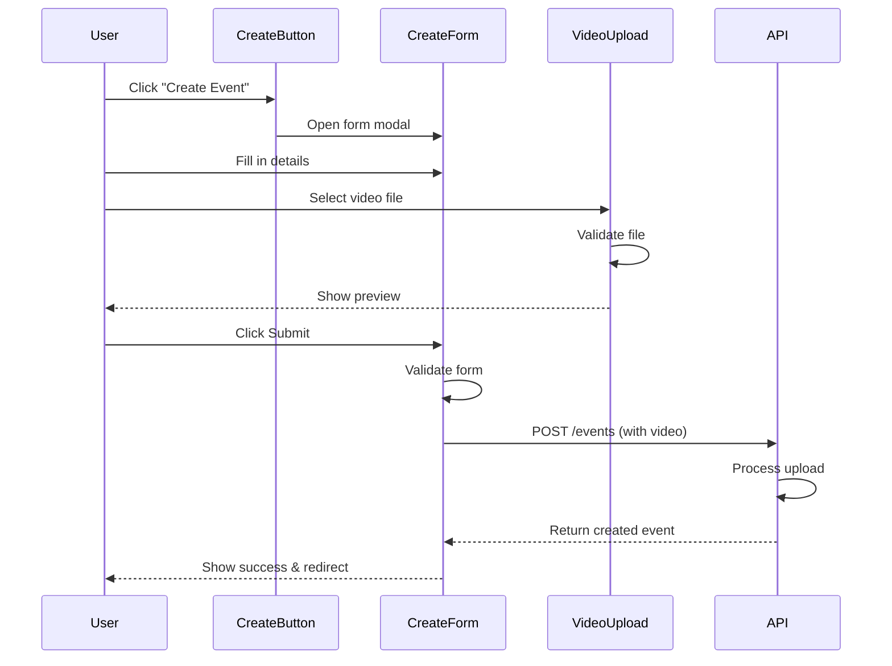

# Event Page Design Document

## Overview

The Event Page is a TypeScript-based feature that provides a comprehensive interface for viewing and creating sports events. The system is organized around three main event categories (Upcoming Events, Ongoing Tournaments, and AmaPlayer Events) with a unified event creation workflow. The design emphasizes type safety, component reusability, and a clean separation of concerns.

## Architecture

### High-Level Architecture



### Component Structure

```
src/
├── pages/
│   └── EventPage.tsx                 # Main event page container
├── components/
│   ├── events/
│   │   ├── EventTabs.tsx            # Tab navigation component
│   │   ├── EventList.tsx            # Reusable event list component
│   │   ├── EventCard.tsx            # Individual event card
│   │   ├── CreateEventButton.tsx    # Create event trigger
│   │   └── CreateEventForm.tsx      # Event creation form
│   └── common/
│       ├── VideoUpload.tsx          # Video upload component
│       └── LocationInput.tsx        # Location input with autocomplete
├── services/
│   ├── eventService.ts              # Event API calls
│   ├── uploadService.ts             # File upload handling
│   └── locationService.ts           # Location autocomplete
├── types/
│   ├── event.types.ts               # Event-related TypeScript types
│   └── form.types.ts                # Form-related types
├── hooks/
│   ├── useEvents.ts                 # Event data fetching hook
│   ├── useEventForm.ts              # Form state management hook
│   └── useVideoUpload.ts            # Video upload logic hook
└── utils/
    ├── validation.ts                # Form validation utilities
    └── constants.ts                 # Constants (sports list, file limits)
```

## Components and Interfaces

### Core Types

```typescript
// event.types.ts

export enum EventCategory {
  UPCOMING = 'upcoming',
  ONGOING_TOURNAMENT = 'ongoing_tournament',
  AMAPLAYER = 'amaplayer'
}

export enum EventStatus {
  UPCOMING = 'upcoming',
  ONGOING = 'ongoing',
  COMPLETED = 'completed',
  CANCELLED = 'cancelled'
}

export interface Event {
  id: string;
  title: string;
  description: string;
  sport: string;
  location: string;
  startDate: Date;
  endDate?: Date;
  status: EventStatus;
  category: EventCategory;
  createdBy: string;
  videoUrl?: string;
  thumbnailUrl?: string;
  participantCount?: number;
  isOfficial: boolean;
  createdAt: Date;
  updatedAt: Date;
}

export interface CreateEventDTO {
  title: string;
  description: string;
  sport: string;
  location: string;
  startDate: Date;
  endDate?: Date;
  videoFile?: File;
}

export interface EventFilters {
  category: EventCategory;
  sport?: string;
  location?: string;
  dateRange?: {
    start: Date;
    end: Date;
  };
}
```

### Main Page Component

**EventPage.tsx** - Container component that manages the overall page state and tab navigation.

```typescript
interface EventPageProps {
  initialCategory?: EventCategory;
}

interface EventPageState {
  activeTab: EventCategory;
  showCreateForm: boolean;
}
```

Key responsibilities:
- Manage active tab state
- Control create event form visibility
- Coordinate between child components

### Event Display Components

**EventTabs.tsx** - Tab navigation for switching between event categories.

```typescript
interface EventTabsProps {
  activeTab: EventCategory;
  onTabChange: (tab: EventCategory) => void;
}
```

**EventList.tsx** - Displays a list of events based on the active category.

```typescript
interface EventListProps {
  category: EventCategory;
  events: Event[];
  loading: boolean;
  error?: string;
  onEventClick: (eventId: string) => void;
}
```

**EventCard.tsx** - Individual event display card.

```typescript
interface EventCardProps {
  event: Event;
  onClick: (eventId: string) => void;
}
```

### Event Creation Components

**CreateEventButton.tsx** - Floating action button or prominent CTA for creating events.

```typescript
interface CreateEventButtonProps {
  onClick: () => void;
  disabled?: boolean;
}
```

**CreateEventForm.tsx** - Complete form for event creation.

```typescript
interface CreateEventFormProps {
  onSubmit: (data: CreateEventDTO) => Promise<void>;
  onCancel: () => void;
  isOpen: boolean;
}

interface FormState {
  title: string;
  description: string;
  sport: string;
  location: string;
  startDate: Date | null;
  endDate: Date | null;
  videoFile: File | null;
  errors: FormErrors;
  isSubmitting: boolean;
}
```

**VideoUpload.tsx** - Handles video file selection and upload preview.

```typescript
interface VideoUploadProps {
  onFileSelect: (file: File) => void;
  onFileRemove: () => void;
  currentFile?: File;
  maxSizeMB?: number;
  acceptedFormats?: string[];
}
```

**LocationInput.tsx** - Location input with optional autocomplete.

```typescript
interface LocationInputProps {
  value: string;
  onChange: (value: string) => void;
  onSelect?: (location: LocationSuggestion) => void;
  placeholder?: string;
  error?: string;
}

interface LocationSuggestion {
  id: string;
  name: string;
  address: string;
  coordinates?: {
    lat: number;
    lng: number;
  };
}
```

## Data Models

### Event Service

```typescript
// eventService.ts

class EventService {
  async getEvents(filters: EventFilters): Promise<Event[]>
  async getEventById(id: string): Promise<Event>
  async createEvent(data: CreateEventDTO): Promise<Event>
  async updateEvent(id: string, data: Partial<CreateEventDTO>): Promise<Event>
  async deleteEvent(id: string): Promise<void>
}
```

### Upload Service

```typescript
// uploadService.ts

interface UploadProgress {
  loaded: number;
  total: number;
  percentage: number;
}

class UploadService {
  async uploadVideo(
    file: File,
    onProgress?: (progress: UploadProgress) => void
  ): Promise<{ url: string; thumbnailUrl?: string }>
  
  validateVideoFile(file: File): { valid: boolean; error?: string }
}
```

### Location Service

```typescript
// locationService.ts

class LocationService {
  async searchLocations(query: string): Promise<LocationSuggestion[]>
  async getCurrentLocation(): Promise<LocationSuggestion>
}
```

## State Management

### Custom Hooks

**useEvents** - Fetches and manages event data.

```typescript
interface UseEventsReturn {
  events: Event[];
  loading: boolean;
  error: string | null;
  refetch: () => Promise<void>;
}

function useEvents(category: EventCategory): UseEventsReturn
```

**useEventForm** - Manages form state and validation.

```typescript
interface UseEventFormReturn {
  formState: FormState;
  updateField: (field: keyof FormState, value: any) => void;
  validateForm: () => boolean;
  resetForm: () => void;
  submitForm: () => Promise<void>;
}

function useEventForm(onSuccess: (event: Event) => void): UseEventFormReturn
```

**useVideoUpload** - Handles video upload logic.

```typescript
interface UseVideoUploadReturn {
  uploadProgress: UploadProgress | null;
  uploadError: string | null;
  isUploading: boolean;
  uploadVideo: (file: File) => Promise<string>;
  cancelUpload: () => void;
}

function useVideoUpload(): UseVideoUploadReturn
```

## Error Handling

### Validation Errors

Form validation will be handled client-side before submission:

```typescript
interface FormErrors {
  title?: string;
  description?: string;
  sport?: string;
  location?: string;
  startDate?: string;
  videoFile?: string;
}

// validation.ts
export const validateEventForm = (data: CreateEventDTO): FormErrors => {
  const errors: FormErrors = {};
  
  if (!data.description || data.description.length < 10) {
    errors.description = 'Description must be at least 10 characters';
  }
  
  if (data.description && data.description.length > 1000) {
    errors.description = 'Description cannot exceed 1000 characters';
  }
  
  if (!data.sport) {
    errors.sport = 'Please select a sport';
  }
  
  if (!data.location) {
    errors.location = 'Location is required';
  }
  
  return errors;
};
```

### API Error Handling

```typescript
// Error types
export class APIError extends Error {
  constructor(
    public statusCode: number,
    public message: string,
    public details?: any
  ) {
    super(message);
  }
}

// Error handling in services
async function handleAPIError(error: any): Promise<never> {
  if (error.response) {
    throw new APIError(
      error.response.status,
      error.response.data.message || 'An error occurred',
      error.response.data
    );
  }
  throw new APIError(500, 'Network error occurred');
}
```

### Upload Error Handling

```typescript
export const VIDEO_UPLOAD_ERRORS = {
  FILE_TOO_LARGE: 'Video file size exceeds 100MB limit',
  INVALID_FORMAT: 'Invalid video format. Supported: MP4, MOV, AVI, WEBM',
  UPLOAD_FAILED: 'Video upload failed. Please try again',
  NETWORK_ERROR: 'Network error during upload'
};
```

## User Experience Flow

### Event Viewing Flow



### Event Creation Flow



## Testing Strategy

### Unit Tests

- **Component Tests**: Test each component in isolation with mocked props
  - EventCard rendering with different event types
  - Form validation logic
  - Video upload validation
  
- **Hook Tests**: Test custom hooks with React Testing Library
  - useEvents data fetching and error states
  - useEventForm validation and submission
  - useVideoUpload progress tracking

- **Utility Tests**: Test validation and helper functions
  - Form validation rules
  - File size and format validation
  - Date formatting utilities

### Integration Tests

- **Form Submission Flow**: Test complete event creation workflow
  - Fill form → Upload video → Submit → Verify API call
  
- **Tab Navigation**: Test switching between event categories
  - Click tab → Verify API call → Verify correct events displayed
  
- **Error Scenarios**: Test error handling
  - Network failures
  - Validation errors
  - Upload failures

### E2E Tests (Optional)

- Complete user journey from landing on event page to creating an event
- Video upload with progress tracking
- Navigation between different event categories

## Performance Considerations

### Optimization Strategies

1. **Lazy Loading**: Load event images and videos lazily as user scrolls
2. **Pagination**: Implement pagination or infinite scroll for large event lists
3. **Debouncing**: Debounce location autocomplete searches
4. **Caching**: Cache event list data with appropriate invalidation
5. **Video Compression**: Consider client-side video compression before upload
6. **Chunked Upload**: Implement chunked upload for large video files

### Bundle Size

- Use code splitting to separate event creation form from main bundle
- Lazy load video upload component only when needed
- Tree-shake unused utilities and components

## Security Considerations

1. **Authentication**: Verify user authentication before allowing event creation
2. **File Validation**: Validate video files on both client and server
3. **XSS Prevention**: Sanitize user-generated content (descriptions)
4. **CSRF Protection**: Implement CSRF tokens for form submissions
5. **Rate Limiting**: Limit event creation and upload requests per user
6. **File Size Limits**: Enforce strict file size limits (100MB)

## Accessibility

1. **Keyboard Navigation**: Ensure all interactive elements are keyboard accessible
2. **ARIA Labels**: Add appropriate ARIA labels to tabs, buttons, and form fields
3. **Focus Management**: Manage focus when opening/closing modal forms
4. **Error Announcements**: Use ARIA live regions for form validation errors
5. **Color Contrast**: Ensure sufficient color contrast for text and interactive elements
6. **Screen Reader Support**: Test with screen readers for event cards and forms
